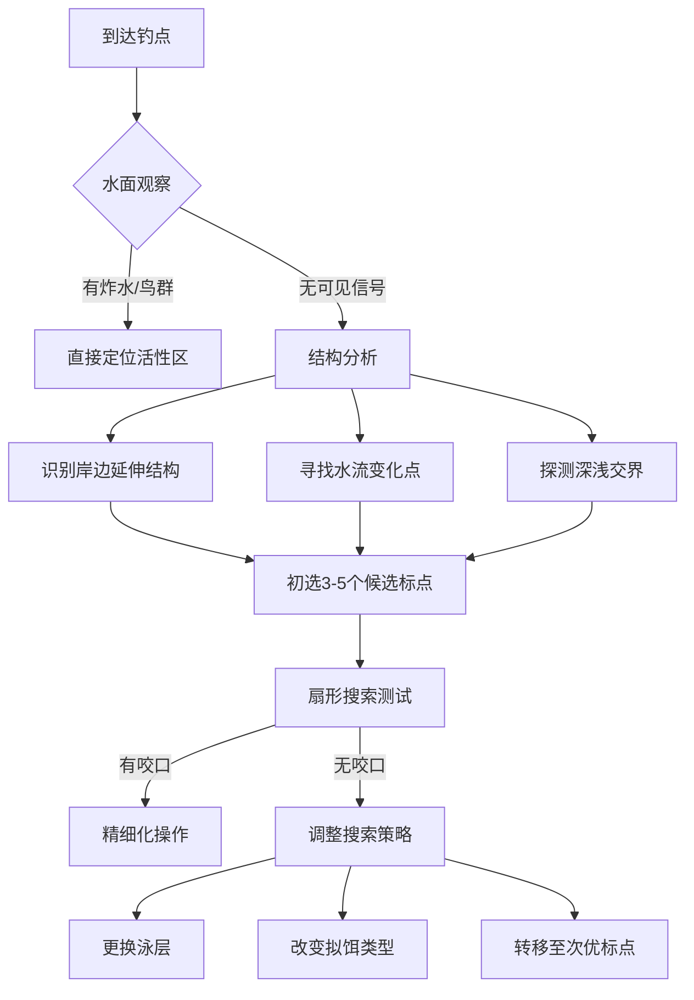

路亚钓鱼作为一项技术性较强的垂钓方式，标点的选择直接决定了作钓的成败。对于新手而言，掌握科学寻找标点的方法能够大幅提升中鱼率，避免长时间"空军"的挫败感。本文将系统介绍路亚标点选择的原理、方法和实用技巧。


## 一、什么是路亚标点？


**路亚标点**指的是水域中目标鱼可能聚集或经常出没的位置，这些位置通常具备以下特征：
- 食物资源丰富
- 水流或水深变化明显
- 能为鱼类提供庇护
- 温度和溶氧条件适宜


## 二、科学寻找标点的四大原则


### 1. 食物链原理
鱼类会本能地选择食物丰富且捕食能耗低的区域：
- **饵鱼聚集区**：小鱼小虾集中的地方必然吸引掠食性鱼
- **食物输送带**：水流交汇处、进水口等会带来大量食物
- **季节食性变化**：春季浅滩（昆虫多），夏季深水（水温适宜）


### 2. 水体结构特征
鱼类利用水体结构作为捕食和躲避的场所：
- **深浅交界**：70%的路亚中鱼发生在深浅过渡区
- **障碍物周边**：倒树、岩石、水草边缘是绝佳标点
- **水下地形突变**：沟坎、陡坡、凹陷处常藏大鱼


### 3. 环境因子影响
- **水温**：鲈鱼最适15-25℃，鳜鱼18-28℃
- **溶氧**：流水区比静水区含氧高30-50%
- **光照**：晴天选择阴影区，阴天可搜索开阔水域


### 4. 天气与时间
- **气压变化**：降雨前24小时咬口率提升40-60%
- **昼夜节律**：日出后2小时和日落前3小时是黄金窗口期
- **月相影响**：满月前后夜间作钓效果更佳


## 三、七种典型标点识别技巧


### 1. 岸边结构
- **倒树和**：提供完美遮蔽，50cm以上水深即可
- **岩石区**：缝隙处常藏鳜鱼、鲶鱼
- **人工建筑**：桥墩、码头立柱形成涡流区


### 2. 水面特征
- **鱼群炸水**：观察水面捕食活动
- **鸟类聚集**：鹭鸟、翠鸟常指示鱼群位置
- **漂浮物聚集**：自然形成障碍区


### 3. 水流特征
- **洄水湾**：流速降低80%，饵鱼聚集
- **主流与支流交汇**：形成温度/溶氧界面层
- **闸口下游**：释放时带来高含氧水流


### 4. 水底地形
- **使用探鱼器**：识别沟壑、隆起等结构
- **观察岸边走势**：水下地形常与岸线平行延伸
- **拖底测试**：通过拟饵触感判断底质


### 5. 季节变化标点
- **春季**：1-3米浅滩（产卵场）
- **夏季**：深水结构区或入水口
- **秋季**：深浅过渡带（饵鱼迁徙路线）
- **冬季**：阳光直射的深坑


### 6. 天气相关标点
- **大风天**：背风岸（食物被吹积）
- **雨天**：入水口（溶氧提升）
- **阴天**：开阔水域（光线均匀）


### 7. 特殊标点
- **温排水口**：冬季关键标点（电厂下游）
- **灯光照射区**：夜间吸引趋光性小鱼
- **水草边缘线**：精确到离草区30-50cm处


## 四、新手实用搜索方法


### 1. 系统性扇形搜索
- 将标点划分为5个扇形区
- 按"外-中-内"顺序抛投
- 每个区域至少尝试3种泳层


### 2. 五步标点评估法
1. 观察水面活动
2. 分析风向水流
3. 判断水深变化
4. 寻找结构特征
5. 测试不同泳层


### 3. 效率优先原则
- 单个标点停留不超过15分钟
- 记录咬口位置（GPS或地标参照）
- 优先搜索"标点中的标点"（如独立障碍物）


## 五、常见错误与改进建议（续）


1. **盲目追求远投**  
   - 错误：70%新手认为抛得越远越好  
   - 事实：岸边3-15米范围内集中了60%以上的攻击  
   - 改进：先精细搜索近岸结构，再逐步延伸  


2. **忽视微观标点**  
   - 错误：只关注明显的大结构  
   - 事实：一个篮球大小的岩石可能藏多条鱼  
   - 改进：对小型独立障碍物进行"点狙击"  


3. **固定泳层搜索**  
   - 错误：全程使用同一深度的拟饵  
   - 科学：水温每下降1℃，鱼类可能下潜0.5-1米  
   - 改进：采用"三层测试法"（表层/中层/底层）  


4. **天气适应性不足**  
   - 典型错误：晴天沿用阴天标点  
   - 数据对比：  
     | 天气 | 最佳标点类型 | 活性时间 |  
     |---|---|---|  
     | 晴天 | 阴影/深水 | 早晚 |  
     | 阴天 | 开阔水域 | 全天 |  
     | 雨天 | 入水口 | 雨中雨后 |  


5. **过度依赖视觉判断**  
   - 提醒：水面平静≠水下无鱼  
   - 解决方案：  
     - 使用振动型拟饵探测活性  
     - 观察水面微小涟漪和气泡  
     - 记录无视觉线索的中鱼点  


## 六、进阶技巧：标点三维分析法


### 1. 水平维度（平面分布）
   - **热点地图法**：记录每次咬口位置，形成密度图  
   - **风向影响**：下风处饵鱼聚集度增加3-5倍  
   - **阳光角度**：顺光观察更易发现鱼群  


### 2. 垂直维度（水深分布）
   - **温度层识别**：夏季常见温跃层（温差≥2℃/米）  
   - **溶氧梯度**：水深每增加1米，溶氧降低0.5-1.5mg/L  
   - **拟饵选择指南**：  
     | 水深 | 推荐拟饵类型 |  
     |---|---|  
     | 0-1m | 波爬、浮水铅笔 |  
     | 1-3m | 悬停米诺、复合亮片 |  
     | 3m+ | 沉水铅笔、VIB |  


### 3. 时间维度（动态变化）
   - **潮汐影响**（咸淡水）：涨潮30%时段活性最高  
   - **昼夜迁移**：鲈鱼日垂直移动可达5-8米  
   - **捕食窗口期**：多数鱼种每天有2-3次高峰  


## 七、特殊环境标点指南


### 1. 水库作钓
   - **淹没结构**：旧河道、树桩（使用卫星历史地图辅助）  
   - **泄洪道下游**：形成含氧量超饱和区  
   - **陡崖壁**：离岸3-5米平行搜索  


### 2. 河流作钓
   - **流速选择**：  
     | 鱼种 | 偏好流速(m/s) |  
     |---|---|  
     | 鳜鱼 | 0.2-0.5 |  
     | 军鱼 | 0.5-0.8 |  
     | 鲶鱼 | <0.3 |  
   - **漩涡区边缘**：流速降低50%的黄金带  


### 3. 夜间作钓
   - **灯光策略**：  
     - 暖光灯吸引昆虫→小鱼→目标鱼  
     - 保持自身处于暗处  
   - **标点优先级**：  
     1. 浅滩（月光照射区）  
     2. 白天标点的上游位置  
     3. 缓流区（夜行性鱼类捕食区）  


## 八、工具与技术辅助


### 1. 现代科技应用
   - **声呐成像**：识别精确到0.5米的结构  
   - **水温探针**：定位温度突变层  
   - **水流计**：量化流速选择标点  


### 2. 传统判断技巧
   - **水色观察**：  
     - 浑浊水：搜索近岸/浅区  
     - 清澈水：聚焦深水/阴影  
   - **气味线索**：  
     - 腥味浓重区可能有鱼群  
     - 藻类


## 九、目标鱼种标点选择专项指南


### 1. 鲈鱼（大口黑鲈）
- **典型标点特征**：
  - 淹没灌木丛（枝条间隙20-50cm最佳）
  - 码头阴影区（立柱下游形成低压区）
  - 水草边缘线（离草从30cm的"攻击走廊"）
- **季节性变化**：
  - 产卵期：硬质底浅滩（1-1.5米）
  - 夏季：深水结构顶部（温差＜3℃区域）
  - 秋季：主河道次级结构（饵鱼迁徙路线）


### 2. 鳜鱼（斑鳜、翘嘴鳜）
- **黄金标点法则**：
  - "三流交汇"：水流+食物流+温度流
  - 障碍物下游1-2米处的缓流区
  - 石缝朝向水流方向的开口处
- **深度选择**：
  | 时段 | 推荐深度 |
  |---|---|
  | 晨昏 | 1-3米 |
  | 正午 | 3-5米 |
  | 夜间 | 0.5-2米 |


### 3. 翘嘴红鲌
- **动态标点系统**：
  - 黎明/黄昏：水面系攻击浅滩
  - 白天：中层悬停搜索开阔水域
  - 集群特征：3条以上炸水即标志鱼群位置
- **水温关联**：
  - 18-22℃时活性最高
  - 每上升1℃向深水移动0.3-0.5米


## 十、气象要素深度解析


### 1. 气压变化影响
- **最佳作钓时机**：
  - 气压持续下降阶段（降幅＞3hPa/6h）
  - 暴雨前2小时（溶氧提升15-20%）
- **拟饵调整建议**：
  - 低气压：慢速颤动型（如rubber jig）
  - 高气压：快速反应饵（如spinner bait）


### 2. 风力利用技巧
- **风向标点公式**：
  ```
  有效标点距离 = 风速(m/s) × 60 + 岸边结构距离
  ```
  - 3级风时重点搜索下风岸50-80米范围
- **波浪影响**：
  - 白浪区含氧量比平静区高25%
  - 使用噪音型拟饵（如crankbait）效果更佳


## 十一、实战标点评估流程图





## 十二、记忆口诀与要点总结


### 1. 标点选择五字诀
**"食隐变氧温"**
- 食：食物来源
- 隐：隐蔽物
- 变：地形/水流变化
- 氧：溶氧充足
- 温：适宜温度层


### 2. 新手优先搜索序列
1. 岸边倒树/岩石下游
2. 深浅交界处突出部
3. 水草区明暗交界线
4. 入水口半径5米范围
5. 独立障碍物周边


### 3. 标点无效时的三步检查
① 是否在正确深度？（使用count down法确认）
② 是否匹配当前活性？（更换诱引强度）
③ 是否在鱼道位置？（观察相邻标点关联性）


## 十三、科学记录与经验积累


### 1. 标点日记要素
- **基础数据**：
  - 日期/时间
  - 水温/气温
  - 气压趋势
  - 水质能见度
- **标点特征**：
  - 水深变化曲线
  - 底质类型
  - 结构物尺寸


## 十四、终极实践检查清单


### 1. 出钓前准备
- [ ] 查看当地72小时气象数据（重点关注气压趋势）
- [ ] 研究水域卫星地图（标注潜在结构区）
- [ ] 准备多类型拟饵（覆盖不同泳层）
- [ ] 检查测深设备电量（探鱼器或铅坠）


### 2. 现场快速评估
- [ ] 观察水面活动（炸水/鸟群/漂浮物）
- [ ] 测试岸边3-5米内的初始标点
- [ ] 确定主风向与水流方向关系
- [ ] 用手试水温（判断温跃层可能位置）


### 3. 标点搜索执行
- [ ] 按"由近及远、由浅入深"原则
- [ ] 每个标点尝试3种以上操作手法
- [ ] 记录咬口时的精确位置特征
- [ ] 保持2小时重新评估标点有效性


## 十五、持续精进的三个方向


### 1. 微观环境感知训练
- 练习通过钓线传导判断底部材质
- 培养观察水面微波纹变化的能力
- 记忆不同天气下的光影折射规律


### 2. 鱼群行为学学习
- 研究目标鱼种的摄食节律
- 了解地域性捕食习惯差异
- 掌握群游性鱼类的信号传递方式


### 3. 装备优化路径
- 建立标点-拟饵-钓竿匹配数据库
- 开发个性化标点评分系统
- 定制季节性标点热力图


## 十六、致路亚新手的终极建议


1. **20-80法则应用**：  
   80%的鱼获来自20%的标点，重点精研高概率区域


2. **三维思维培养**：  
   每次抛投都要明确：  
   - 水平位置（几点钟方向）  
   - 垂直深度（秒数计数）  
   - 时间节点（活性时段）  


3. **科学验证精神**：  
   - 对传统钓点保持怀疑态度  
   - 用控制变量法测试标点假设  
   - 建立自己的标点有效性评估体系  


记住：寻找标点既是科学也是艺术，随着经验积累，您将发展出独特的"读水"能力。保持耐心，持续观察，终将掌握这项路亚钓鱼的核心技能。祝您每次出钓都能发现黄金标点，收获满满！
